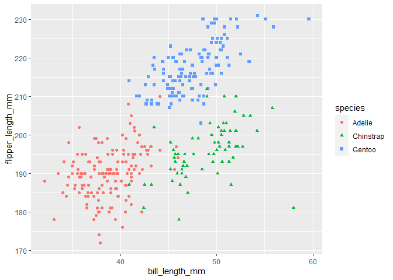

Solution for Homework 1
================
Jacky Tao
2022-09-15

# Problem 1

Load the `penguins` dataset first.

``` r
data("penguins", package = "palmerpenguins")
```

Then, let’s describe the dataset!

Here’s the summary of the dataset.

``` r
summary(penguins)
```

    ##       species          island    bill_length_mm  bill_depth_mm  
    ##  Adelie   :152   Biscoe   :168   Min.   :32.10   Min.   :13.10  
    ##  Chinstrap: 68   Dream    :124   1st Qu.:39.23   1st Qu.:15.60  
    ##  Gentoo   :124   Torgersen: 52   Median :44.45   Median :17.30  
    ##                                  Mean   :43.92   Mean   :17.15  
    ##                                  3rd Qu.:48.50   3rd Qu.:18.70  
    ##                                  Max.   :59.60   Max.   :21.50  
    ##                                  NA's   :2       NA's   :2      
    ##  flipper_length_mm  body_mass_g       sex           year     
    ##  Min.   :172.0     Min.   :2700   female:165   Min.   :2007  
    ##  1st Qu.:190.0     1st Qu.:3550   male  :168   1st Qu.:2007  
    ##  Median :197.0     Median :4050   NA's  : 11   Median :2008  
    ##  Mean   :200.9     Mean   :4202                Mean   :2008  
    ##  3rd Qu.:213.0     3rd Qu.:4750                3rd Qu.:2009  
    ##  Max.   :231.0     Max.   :6300                Max.   :2009  
    ##  NA's   :2         NA's   :2

I think `species`, `island` are important qualitative variables, and
`flipper_length_mm`, `body_mass_g` are important quantitative variables.

The dataset has 344 rows and 8 columns.

The mean flipper length is 200.92 mm.

Make a scatterplot of `flipper_length_mm`(y) vs `bill_length_mm`(x).

``` r
ggplot(data = penguins,
       aes(x = bill_length_mm,
           y = flipper_length_mm)) + 
  geom_point(aes(color = species,
                 shape = species))
```

<!-- -->

Export my scatterplot.

``` r
ggsave("p8105_hw1_jt3386_scatterplot.pdf")
```

# Problem 2

First create a data frame.

``` r
pb2_df = 
  tibble(
    rdm_sample = rnorm(10),
    rdm_sample_pos = rdm_sample > 0,
    chr_sample = c("A", "B", "C", "D", "E", "F", "G", "H", "I", "J"),
    fct_sample = factor(x = c(1, 3, 2, 1, 1, 3, 2, 2, 1, 3),
                        labels = c("One", "Two", "Three"))
  )
pb2_df
```

    ## # A tibble: 10 × 4
    ##    rdm_sample rdm_sample_pos chr_sample fct_sample
    ##         <dbl> <lgl>          <chr>      <fct>     
    ##  1     1.06   TRUE           A          One       
    ##  2    -0.497  FALSE          B          Three     
    ##  3     0.0235 TRUE           C          Two       
    ##  4    -0.176  FALSE          D          One       
    ##  5     0.222  TRUE           E          One       
    ##  6    -0.104  FALSE          F          Three     
    ##  7     0.706  TRUE           G          Two       
    ##  8    -0.197  FALSE          H          Two       
    ##  9     0.130  TRUE           I          One       
    ## 10    -0.430  FALSE          J          Three

Take the mean of each variable.

``` r
mean(pull(pb2_df,rdm_sample))
```

    ## [1] 0.07373229

``` r
mean(pull(pb2_df,rdm_sample_pos))
```

    ## [1] 0.5

``` r
mean(pull(pb2_df,chr_sample))
```

    ## [1] NA

``` r
mean(pull(pb2_df,fct_sample))
```

    ## [1] NA

The double variables and the logical variables work, however, the
character variables and the factor variables don’t work.

Apply the `as.numeric` function to the logical, character, and factor
vector.

``` r
as.numeric(pull(pb2_df,rdm_sample_pos))
as.numeric(pull(pb2_df,chr_sample))
as.numeric(pull(pb2_df,fct_sample))
```

The logical variables are converted to 0 or 1. If the value is TRUE, it
will be converted to 1. And if the value is FALSE, it will be converted
to 0.

The character variables can not be converted to numeric variables.

The factor variables can be converted to numeric variables and the
numeric codes corresponding to the factor levels will be returned.

This could help explain that I can take the mean of logical variables
because they are just converted to numeric variables, but that could not
help explain why I cannot take the mean of factor variables.
